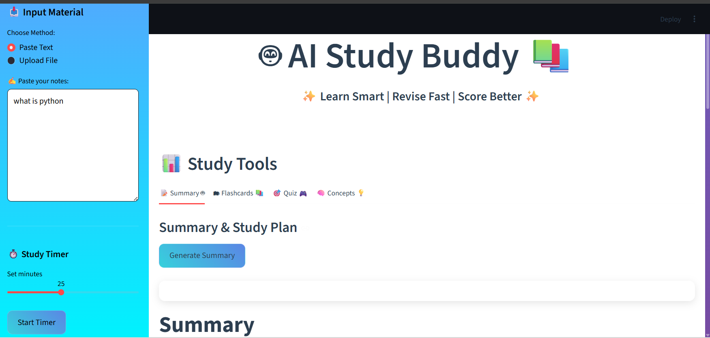
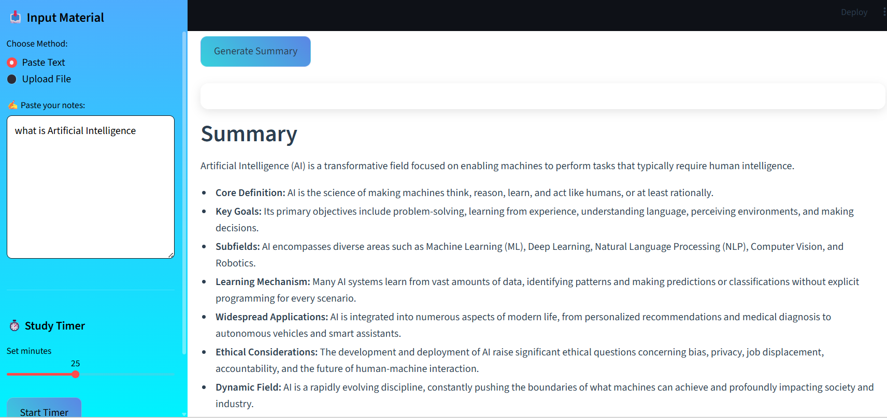
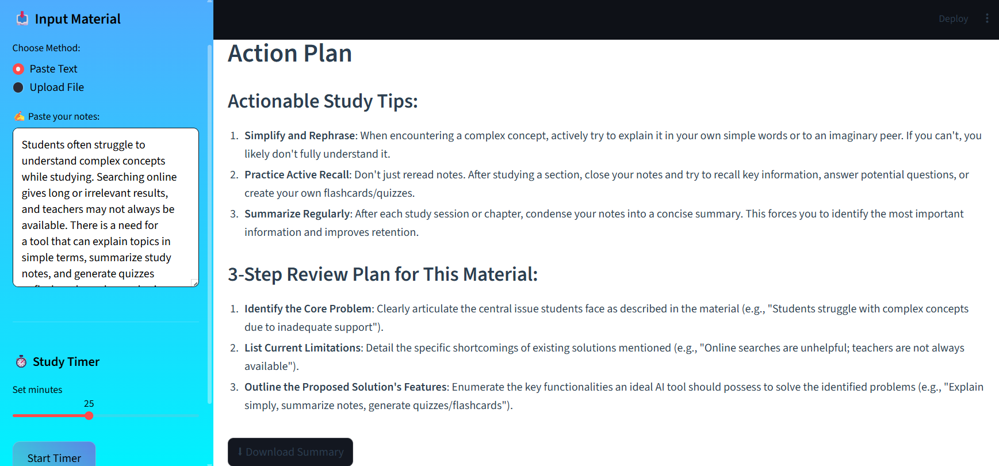
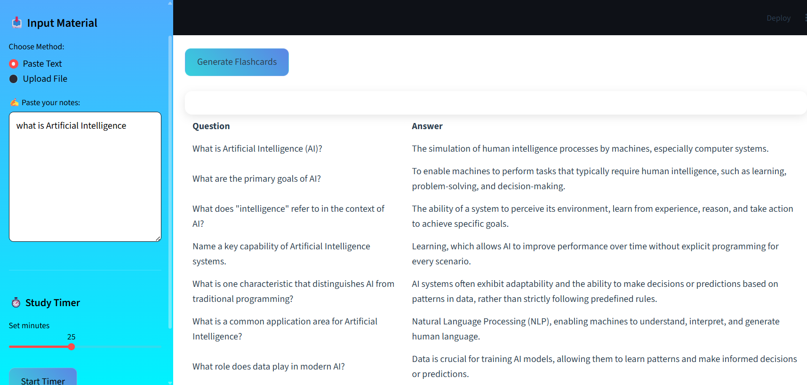
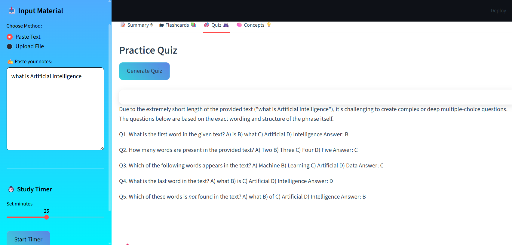
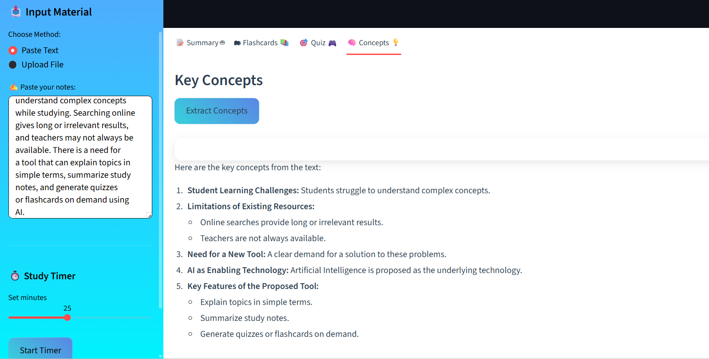

# 🤖 AI-Powered Study Buddy 📚 #   (Web app)

✨ Learn Smart | Revise Fast | Score Better ✨

---

## 📌 Overview

AI-Powered Study Buddy is an intelligent study assistant built using Streamlit and Google Gemini API.
It helps students convert their study material into summaries, flashcards, quizzes, and key concepts to improve learning efficiency and retention.

---

## 🚀 Features

* 📝 Generate concise summaries from notes
* 🗂 Create flashcards for quick revision
* 🎯 Generate practice quizzes automatically
* 🧠 Extract important concepts
* 📊 Track study progress
* ⏱ Built-in Pomodoro-style study timer
* 📄 Supports both PDF and text input

---

## 🛠 Tech Stack

* Python
* Streamlit
* Google Gemini API
* PyMuPDF (PDF text extraction)
* python-dotenv (environment variable management)

---

## 📂 Project Structure

```
AI-Study-Buddy/
│── app.py                 # Main Streamlit app
│── ai_functions.py        # AI logic and Gemini API integration
│── requirements.txt       # Project dependencies
│── .env                  # API key (not pushed to GitHub)
│── README.md              # Project documentation
```

---

## ⚙️ Installation & Setup

### 1️⃣ Clone the repository

```
git clone https://github.com/akshata-sa-vant/batch-7-AICTE.git
cd batch-7-AICTE
```

---

### 2️⃣ Create a virtual environment

```
python -m venv venv
```

Activate the environment:

* Windows:

```
venv\Scripts\activate
```

* Mac/Linux:

```
source venv/bin/activate
```

---

### 3️⃣ Install dependencies

```
pip install -r requirements.txt
```

---

## 🔑 Setup API Key

Create a `.env` file in the root directory and add your Google Gemini API key:

```
GEMINI_API_KEY=your_api_key_here
```


## ▶️ Run the Application

```
streamlit run app.py
```

Your app will open in the browser automatically.

---

## 📸 Screenshots


Example:

* Home screen

* Summary generation


* Flashcards view

* Quiz section

* key concepts



---


## 📌 Future Improvements

* User authentication system
* Save study history
* Spaced repetition learning
* Export notes as PDF
* Enhanced UI/UX

---

## 🤝 Contributing

Contributions are welcome!
Feel free to fork this repository and submit pull requests.

---

## 📄 License

This project is licensed under the MIT License.

---

## ⭐ Support

If you like this project, please give it a ⭐ on GitHub!
